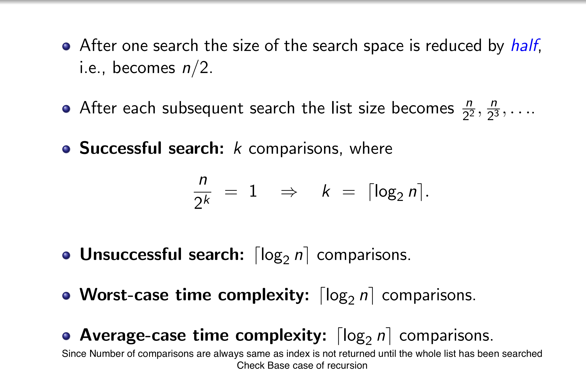
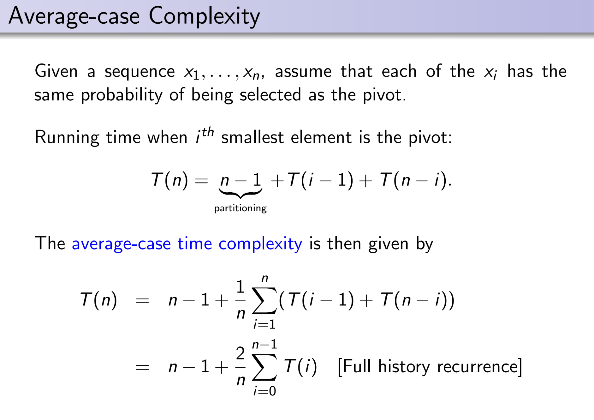
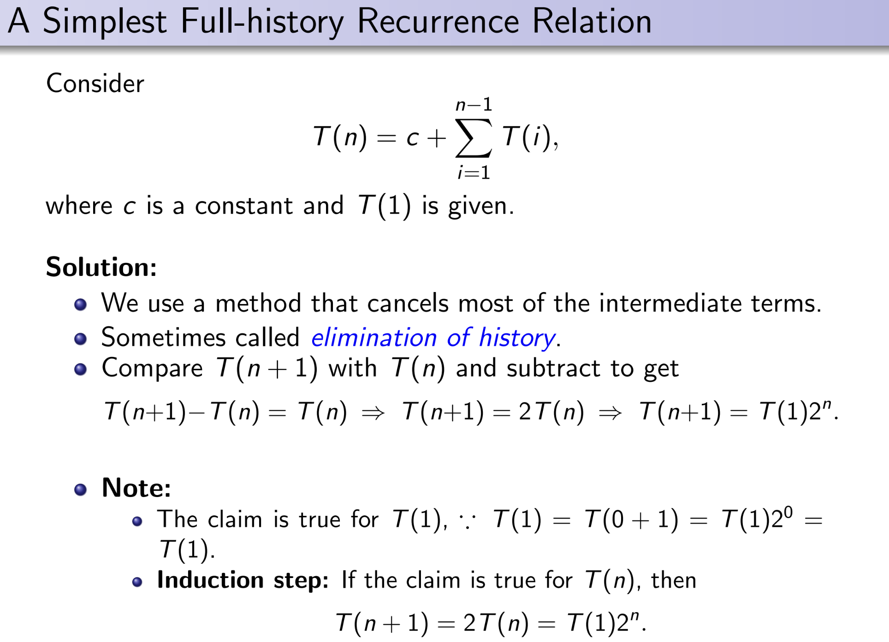
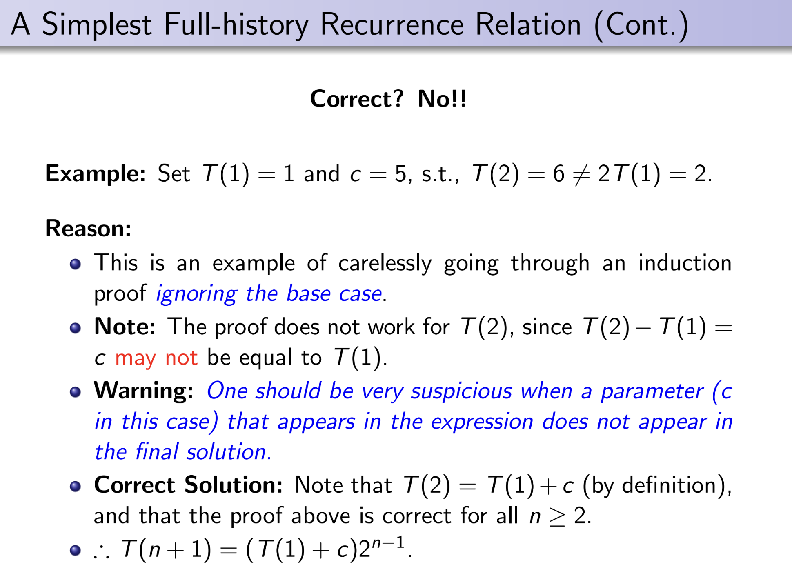
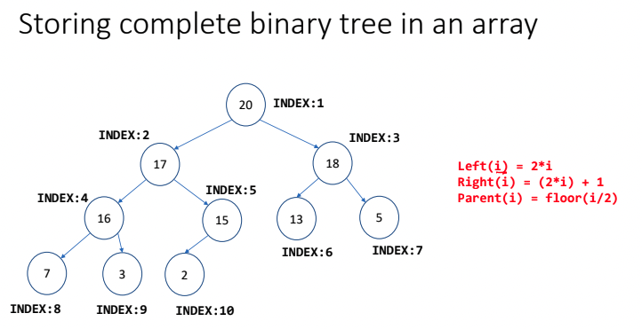

# Data Structure and Algorithm
#### By - [Shivoy Arora](https://github.com/arorashivoy)

**Prof - Subharata Samajder**
Email - subharata@iiitd.ac.in
Classroom Code - S34dfee

# Intro to Algorithm

**Algorithm:** A finite sequence of elementary operations with the objective of performing some (computational) task

### Elementary Operation
The elementary operation that we will consider will be at a higher level and include arithmetic and logical operations.

## Efficiency of an algorithm

* Time: Number of steps required by the algorithm to produce its output
  * Assumption: Each elementary operation require unit time
* Space: Number of temporary variables
* Size of inputs: A function from the set of all possible inputs to *Z^+^*
* **NOTE:** Size of input is the number of binary bits required to represent the numbers

## Runtime function of an algorithm
T(n): Number of steps required by the algorithm on an input of size n

**Worst case time complexity:** T(n) is the maximum of the different numbers of steps that the algorithm requires for different inputs of size n

**Average-case time complexity:** Consider the average case behavior of the algorithm
* For each n, the set if all inputs of size n is assumed to be finite
* Define a uniform distribution on this set
* Then the time function T(n) becomes a random variable
* Average case complexity = E[T(n)]

!!! 
	T(n) is a distinct random variable, where T(n) is the number of steps required by the algorithm.
	E[T(n)] is the average of distinct random variable


<!-- Lecture 2 - 28.4.22-->
## Linear search
* **Size of input:** Len of L
* **Time Complexity:** Number of comparisons of the type 'L[i] == s'
  * \# other operations ∝ \# comparisons

#### Worst-case Complexity
* **Unsuccessful search:** n comparisons
* **Successful search:** between 1 to n comparisons
* **Worst-case complexity:** n comparisons
* ∴ \# steps n the worst case = c~1~n, for some constant c~1~
	
#### Average-case Complexity


## Binary Search

I/P: L ( a sorted array in the range 1 to n), and z (the search key)
O/P: Position (An index i such that L[i]=s, assuming zero index doesn't exist)

```
BEGIN
	Position := Find(s, 1, n)
END

function Find(s, Left, Right) -> Integer
	BEGIN
		if (Left = Right)
			if (L[Left] = s )
				return Left
			else
				return 0
		else
			Middle = [1/2(Left + Right)] + 1
			If (s < L[Middle])
				return Find(s, Left, Middle-1)
			else
				return Find(s, Middle, Right)
	END
```



* \# steps in the worst-case = c~2~⌈log~2~ n⌉, c~2~ = constant

## Measure of performance
The performance of an algorithm is measure by its worst-case time complexity

But it has a constant in that depends on many things

# Big-O Notation
Let g and f be functions from the set of natural number to itself.
The function f is said to be $O(g)$, if there is a constant c and a natural number n~o~ such that
$f(n)≤cg(n)\ for\ all\ n > n_0$

**Example:**
* Linear search: $O(n)$
* Binary search: $O(log_2n)$
* For time complexity: 5n^2^+15 = $O(n^2)$
* Also: 5n^2^+15 = $O(n^3)$
* $O(1)$ denote a constant.

**\#Notes:**
$O(g)$ is a set
We write f = $O(g)$ to mean f $\in O(g)$

## Poly-time 

* $O(n^c)$
* Identified with efficient algorithms

## Exponential time
* $O(2^n)$
* Identified with inefficient algorithms

**\#Notes:**
For any given problem, it is of interest to design a polynomial time algorithm

## Results 
**Monotonically growing function:** If n~1~ > n~2~ => f(n~1~) ≥ f(n~2~)

!!! Danger Theorem
	For all constants c > 0 and a > 1, and for all monotonically increasing function f(n),
	$$ (f(n))^c = O(a^{f(n)}) $$

	In other words, an exponential function always grows faster than a polynomial function

!!! Note Lemma
  	If f(n) = $O(s(n))$ and g(n) = $O(r(n))$, then:
	* f(n) + g(n) = $O(s(n)+r(n))$
	* f(n).g(n) = $O(s(n).r(n))$

<details>
<summary> Other notations </summary>

# Big Ω notation

If there exist constant c and N, such that all n > N the number of steps T(n) required to solve the problem for input size n is at least cg(n), i.e.,
$T(n) ≥ cg(n)$
Then, we say hat T(n) = $Ω(g(n))$

Thus, Ω notation corresponds to '≥' relation

# Big θ notation
If a certain function f(n) satisfies both f(n) = $O(g(n))$ and f(n) = $Ω(g(n))$, then we say that
 $f(n) = θ(g(n))$

Thus, θ notation corresponds to '≤' relation

# Small-oh or Little-oh Notation
We say that f(n) = o(g(n)) if
$$ \lim_{n->\infin} f(n)/g(n) = 0 $$

# ω Notation
We say that f(n) = ω(g(n)) if 
$g(n) = o(f(n))$

In other words, it means that for any positive constant c there exist a constant N, such that
0 ≤ cg(n) < f(n), for all n ≥ N
The value of N must not depend on n, but may depend on c

</details>
<!-- Lecture 3 - 2.5.22-->
# Recursion
A function is said to be recursive if it calls itself, either directly or indirectly

* **Stack Overflow:** 
  * Error
  * stack ends
  * recursion is called for a lot of times


## Golden Ratio

φ = (1 + √5)/2 = 1.618033...

**Poly equation:** x^2^ - x - 1 = 0
* It is a special number
* Reciprocal of golden number = 0.618, which is only the decimal part of the golder number
* Golden ratio and Binet's function are used to calculate time complexity of algorithms

## Tower of Hanoi Problem
```c
void towerOfHanoi(int disc, char src, char des, char aux) {
    if (disc == 1) {
        printf("Send %d from %c to %c\n", disc, src, des);
    }
    else {
        towerOfHanoi(disc - 1, src, aux, des);
        printf("Send %d from %c to %c\n", disc, src, des);
        towerOfHanoi(disc - 1, aux, des, src);
    }
}
```

# Recurrence
A recurrence relation is an equation that expresses each element of a sequence {a~n~}^∞^~n=0~ as a function of the preceding ones, i.e.,

a~n~ = φ(a~0~, ..., a~n-1~)

* Computing time/space complexity = a counting problem

**Techniques of solving recurrences:**
* Intelligent Guesses
* Recursion Tree


## Intelligent Guesses
* Guessing a solution may seem like a non-scientific method
* It works better when we are not trying to find the exact solution, but only a upper bound
* Proving that a certain bound is easier than deriving a bound
	
	

<!-- Lecture 4 - 5.5.22-->
# Merge Sort
## Code 
```c
void merge(int arr[], int lo, int mid, int hi) {
    int i, j, k;

    int n1 = mid - lo + 1;
    int n2 = hi - mid;

    // Creating temp arrays
    int tmp1[n1];
    int tmp2[n2];

    for (i = 0; i < n1; i++) {
        tmp1[i] = arr[lo+i];
    }
    for (j = 0; j < n2; j++) {
        tmp2[j] = arr[mid+1+j];
    }

    // Comparing and adding
    i = j = 0;
    k = lo;
    while(i < n1 && j < n2) {
        if (tmp1[i] <= tmp2[j]) {
            arr[k] = tmp1[i];
            i += 1;
        }
        else {
            arr[k] = tmp2[j];
            j += 1;
        }
        k += 1;
    }

    // Adding the left over elements
    while (i < n1) {
        arr[k] = tmp1[i];
        i += 1;
        k += 1;
    }
    while ( j < n2) {
        arr[k] = tmp2[j];
        j += 1;
        k += 1;
    }
}
```

```c
void mergeSort(int arr[], int lo, int hi) {
    if (lo >= hi) {
        return;
    }
    int mid = (lo + hi) / 2;
    // recursively sort the first half
    mergeSort(arr, lo, mid);
    // recursively sort the second half
    mergeSort(arr, mid + 1, hi);
    // merge the sorted arrays
    merge(arr, lo, mid, hi);
}
```
In this we take two sorted lists A = [a~1~, ..., a~n~] and B = [b~1~, ..., b~m~], where both A and B are sorted in increasing order

## Merge Algorithm
* Scan the first list (A) until the right place to insert b~1~ is found
* Continue to scan from from that place until the right place to insert b~2~ is found
* Repeat this for all the elements of B

**Note:**
* Since the lists are sorted we never have to go back
* The total number of comparisons in the worst case is n+m

**Complexity:**
* Time: $O(n+m)$ comparisons
* Space: $O(n+m)$ data

> This Merge Algorithm is used as a basis for the merge sort algorithm in which we divide-and-conquer

## Merge Sort Algorithm
* Divide the list in two equal parts
* Sort each part using recursion
* Merge the two sorted parts using Merge Algorithm

# Recurrences: Divide and Conquer


## Cases
* a > b^k^
  * The series converges to a constant as m -> $\infty$
  * T(n) = $O(a^m)$ = $O(a^{log_bn})$ = $O(n^{log_ba})$, since m = log~b~n
* a = b^k^
  * T(n) = $O(a^mm)$ = $O(n^k log_b n)$, since a=b^k^, k=log~b~a, m=log~b~n
* a < b^k^
  * Let F = (b^k^/a) > 1 
  * T(n) = a^m^(F^m+1^-1)/(F-1)
  * T(n) = $O(a^mF^m)$ = $O((b^k)^m)$ = $O((b^m)^k)$ = $O(n^k)$

# Master's Theorem

!!! Danger Theorem
	The solution of the recurrence relation T(n) = aT(n/b) + cn^k^, where
	a and b are positive integers a≥1, b≥2 and c and k are positive constant

	T(n) = $O(n^{log_ba})$, For a > b^k^
	T(n) = $O(n^k log_b n)$, For a = b^k^
	T(n) = $O(n^k)$, For a < b^k^


# Merge Sort: Cost Analysis

T(n) = $O(n\ log_2n)$

**Drawbacks:**
* Not as easy to implement
* Additional storage is required at each merge step


<!-- Lecture 5 - 9.5.22-->
# Quick Sort
## Code
```c
void quicksort(int arr[], int lo, int hi) {
    if (lo >= hi) {
        return;
    }
    int p = partition(arr, lo, hi);
    quicksort(arr, lo, p - 1);
    quicksort(arr, p + 1, hi);
}
```

```c
int partition(int arr[], int lo, int hi) {
    int pivot = arr[lo];
    int left = lo;
    int right = hi;
    while (left < right) {
        while (left <= right && arr[left] <= pivot) {
            left += 1;
        }
        while (right >= left && arr[right] > pivot) {
            right -= 1;
        }
        if (left < right) {
            exchange(arr, left, right);
        }
    }
    exchange(arr, lo, right);
    return right;
}
```

## The Divide step
* Suppose that we know a number x such that one-half of the elements are > x and the other ≤ x.
* Compare and partition the sequences into two parts
* This partition requires n-1 comparisons

## The Combine step
* The two parts already occupy the correct positions in the array
* Therefore, no additional space is required

## Partitioning algorithm
* Use two pointers to that array, L and R
* Initially,
  * L points to the left and R points to the right side of the array
* The pointer move in opposite directions towards each other
* Swap(x~L~, x~R~): If x~L~ > pivot and x~R~ ≤ pivot

## Correctness
* At step k of the algorithm, pivot ≥ x~i~, for all i < L, and pivot < x~j~ for all j > R
* Terminal: When L = R

## Cost Analysis

* If the pivot always partitions the list into two equal parts, then
	T(n) = 2T(n/2) + $O(n)$  
	T(2) = 1  
	=> T(n) = $O(n\ log\ n)$

* However, if the pivot is very close to one side of the sequence, then the run time is much higher.
* Eg: If the sequence is already sorted then, T(n) = $O(n^2)$
* The quadratic worst case for (almost) sorted sequence can be eliminated by
  * comparing the first, last and middle elements
  * and then taking their median (the second largest) as the pivot
* **Safer method:** Choose the pivot randomly
* **Worst-case complexity:** $O(n^2)$
* However, the likelihood that this worst case occurs is very small

## Average-case complexity


# Full history Recurrences
A full-history recurrence relation is one that depends on all the previous values of the function, not just on a few of them.




## Average-case Complexity (Approximation)
[Harmonic Series Approximation](./Resources/HarmonicSeriesApproximation.pdf)


<!-- Lecture 6 - 12.5.22 -->
# Data Structures
A data structure is a data organization, management and storage format that enables efficient access and modification.

More precisely, A data structure is a collection of data values, the relationship among them, and the functions or operations that can be applied to the data.

## Abstract Data Type (ADT)
An abstract data type is a mathematical model for data types, where its data type is defined by its behavior (semantics) from the point of view of a user of the data, specifically in terms of possible values, possible operations on data of this type and the behavior of these operations

# Stacks and Queue

* Stack functions :-
  * <abbr title="Last In First Out">LIFO</abbr>
  * <abbr title="Add an element to the stack">PUSH</abbr>
  * <abbr title="Remove the top most element from the stack">POP</abbr>
  * <abbr title="See the topmost element in the stack">PEEK</abbr>

* Queue functions :-
  * <abbr title="First In First Out">FIFO</abbr>
  * <abbr title="Add an element to the queue">ENQUEUE</abbr>
  * <abbr title="Remove the first element from the queue">DEQUEUE</abbr>

## Dynamic Stacks
Using [Linked List](#linked-lists)
### Structure
```c
struct stack {
    struct node* head;
}
```

### Allocation
```c
struct stack* initialize_stack() {
    struct stack *S = (struct stack*)malloc(sizeof(struct stack));
    assert(S);
    S->head = NULL;
    return S;
}
```

### isEmpty
```c
/**
 * Check if the stack is empty
 * 
 * @param S the stack to check
 * @returns 1 if empty, else 0
 */
int isEmpty(struct stack* S) {
    if (S->head == NULL) {
        return 1;
    }
    return 0;
}
```

## PUSH
```c
void push(struct stack* S, int val) {
    struct node* n = allocateNode(int val);

    if (S->head == NULL) {
        S->head = n;
    }
    else {
        S->head = insertFront(S->head, n);
    }
}
```

### POP
```c
int pop(struct stack *S) {
    if (isEmpty(S)) {
        printf(“stack underflow\n”);
        exit(0);
    }
    struct node *ret = deleteFront(&S->head);
    int retVal = ret->val;
    free(ret);
    return retVal;
}
```


## Static Queue
[Queue Note](Resources/Queue.pdf)
[Code](Resources/Queue.c)

## Dynamic Queue
### Structure
```c
struct queue {
    struct node* head;
    struct node* tail;
};
```

### Initializing
```c
/**
 * Initialize a queue
 *
 * @return a queue with head and tail as NULL
 */
struct queue* initializeQueue() {
    struct queue* q = (struct queue*) malloc(sizeof(struct queue));
    assert(q);
    q->head = NULL;
    q->tail = NULL;

    return q;
}
```

### Queue is empty
```c
int isEmpty(Struct queue* q) {
    if (Q->head == NULL) {
        return 1;
    }
    return 0;
}
```

### Enqueue
```c
void enqueue(struct queue* q, int val) {
    struct node* n = allocateNode(val);
    if (isEmpty(q) == 1) {
        q->head = q->tail = n;
    }
    else {
        q->tail->next = n;
        q->tail = n;
    }

}
```

### Dequeue
```c
int dequeue(struct queue *Q) {
    if (queue_empty(Q)) {
        printf("Queue underflow\n");
        exit(0); 
    }

    struct node *ret = delete_front(&Q->head);
    int retVal = ret->val;
    free(ret);
    return retVal;
}
```


# Linked Lists
* Linked list is almost like an array, except the address of the two consecutive elements of the list may not be consecutive
* Linked list always support extension if the memory is available

The base address of a linked list is stored in the variable ptr

Every element in the linked list also stores the address of the next node


> **NOTE:** Might have to manage error for the condition when the element is NULL for the code below
### Structure
```c
/**
 * Structure of a single Node
 * 
 * @param val value of the current node
 * @param next address of the next node
 */
struct node {
    int val;
    struct node *next;
};
```

### Allocation
```c
/**
 * Creating a new single Node
 * 
 * @param val value of the node
 * 
 * @return single node with the next element as NULL
 */
struct node* allocateNode(int val) {
    struct node *n = (struct node*) malloc(sizeof(struct node));
    
    n->val = val;
    n->next = NULL;
    return n;
}
```

### Printing
```c
/**
 * Printing the Linked List
 * 
 * @param head the list to be printed
 */
void printList(struct node* head) {
    struct node* temp = head;
    while (temp != NULL) {
        printf("%d ", temp->val);
        temp = temp->next;
    }
    printf("\n");
}
```

### Insertion (Front)
```c
/**
 * Inserting a single node to the front of the list
 * 
 * @param head the initial list
 * @param n the single node to be added
 * 
 * @return the final list after addition
 */
struct node* insertFront(struct node* head, struct node* n) {
    n->next = head;
    return n;
}
```

### Insertion (Rear)
```c
/**
 * Insert an element at the end of the Linked List
 * 
 * @param head initial linked list
 * @param n the node to be inserted
 */
void insertRear(struct node* head, struct node* n) {
    struct node* temp = head;
    while (temp->next != NULL) {
        temp = temp->next;
    }
    temp->next = n;
}
```

### Insertion (Specific position)
```c
/**
 * Insert the node at a specific position
 * 
 * @param head the list
 * @param n node to be inserted
 * @param position position to insert n at
 */
void insertPos(struct node* head, struct node* n, int position) {
    struct node* temp = head;
    for (int i = 0; i < position; i++) {
        // breaking if temp is NULL
        if (temp == NULL) {
            break;
        }
        temp = temp->next;
    }
    n->next = temp->next;
    temp->next = n;
}
```

### Search 
```c
/**
 * Search an element in the list
 * 
 * @param head the list
 * @param val the value to be searched
 * 
 * @return Node whose value is val, else NULL
 */
struct node* search(struct node* head, int val) {
    struct node* temp = head;
    while (temp != NULL) {
        if (temp->val == val) {
            return temp;
        }
        temp = temp->next;
    }
    return NULL;
}
```

### Delete (Front)
```c
/**
 * Delete the element at the front of the list
 * 
 * @param head pointer of the Linked List
 * 
 * @return the removed element
 */
struct node* deleteFront(struct node** head) {
    struct node* temp = *head;
    *head = temp->next;
    // Returning the removed element
    return temp;
}

```

### Delete (Rear)
```c
/**
 * Delete the last element of the linked list
 * 
 * @param head pointer of the linked list
 * 
 * @return the deleted element
 */
void deleteRear(struct node** head) {
    struct node* temp = *head;
    struct node* prev = temp;

    // If the list only have one element
    if (temp->next == NULL) {
        *head = NULL;
        // Returning the removed element
        return temp;
    }

    // If the list has more one element
    while (temp->next != NULL) {
        prev = temp;
        temp = temp->next;
    }
    prev->next = NULL;
    return temp;
}
```

### Deleting a given node
```c
/**
 * Delete a given node from the linked list
 * 
 * @param head pointer of the linked list
 * @param n node to be deleted
 * 
 * @return the deleted node, else NULL
 */
struct node* delete(struct node** head, struct node* n) {
    struct node* temp = *head;
    // If head is the node to be deleted
    if (temp == n) {
        *head = temp->next;
        return temp;
    }

    struct node* prev = temp;
    while (temp->next != NULL && temp != n) {
        prev = temp;
        temp = temp->next;
    }
    if (temp == n) {
        prev->next = temp->next;
        return temp;
    }
    return NULL;
}
```

### Reversing a linked list
```c
/**
 * Reversing linked list
 * 
 * @param head the linked list to be reversed
 * 
 * @return reversed linked list
 */
struct node* reverseList(struct node* head) {
    struct node* prev = NULL;
    struct node* curr = head;
    struct node* next = curr->next;

    while (curr != NULL) {
        next = curr->next;
        curr->next = prev;
        prev = curr;
        curr = next;
    }

    return prev;
}
```

#### Using recursion
```c
struct node* reverseListRec(struct node* head) {
    if (head == NULL) {
        return NULL;
    }
    struct node* next = head->next;
    if (next == NULL) {
        return head;
    }
    struct node* headSubList = reverseListRec(next);
    next->next = head;
    head->next = NULL;
    return headSubList;
}
```

## Application of linked list
* Polynomial operations using linked list

## Singly Linked list
The linked list above is known as singly linked list

## Doubly Linked list
```c
struct node {
    int val;
    struct node* next;
    struct node* prev;
}
```

# Binary Tree Node 

> **\#NOTE:** The code below might be incorrect

* A (rooted) tree has a hierarchical structure
* Size of binary tree is the number of nodes in the tree
* The depth of the node is the distance of the node from the root

```c
/**
 * Structure of a rooted Binary Tree
 * 
 * @param val value of the current node
 * @param left pointer to the left node
 * @param right pointer to the right node
 */
typedef struct BTNode {
    int val;
    BTNode* left;
    BTNode* right;
} BTNode;
```

## Tree transversal
* **Pre-order transversal:** ==root==, left, right
* **In-order transversal:** left, ==root==, right
* **Post-order transversal:** left, right, ==root==

**Complexity:** $O(n)$

* Different tree may have same transversal.
* A tree cannot be constructed from just one transversal sequence.
* But, given two traversals one can reconstruct the tree uniquely.

### Pre-order transversal
```c
/**
 * Pre-order printing of the Binary Tree recursively
 * 
 * @param root node of the binary tree
 */
void preDisplay (BTNode *root) {
    if (root!=null) {
        printf (”%d, ”, root->val);
        display (root->left);
        display (root->right);
    }
}
```

### In-order transversal
```c
/**
 * In-order printing of the Binary Tree recursively
 * 
 * @param root node of the binary tree
 */
void inDisplay (BTNode *root) {
    if (root!=null) {
        display (root->left);
        printf (”%d, ”, root->val);        
        display (root->right);
    }
}
```

### Post-order transversal
```c
/**
 * Post-order printing of the Binary Tree recursively
 * 
 * @param root node of the binary tree
 */
void postDisplay (BTNode* root) {
    if (root!=null) {
        display (root->left);
        display (root->right);
        printf (”%d, ”, root->val);
    }
}
```

## Counting nodes
```c
/**
 * Count the number of nodes in the tree
 *
 * @param root node of the binary tree
 *
 * @return number of nodes
 */
int count(BTNode* root) {
    if (root == NULL) {
        return 0;
    }
    else {
        return 1 + count(root->left) + count(root->right);
    }
}
```

## Height of a tree
The height of a binary tree is the number of levels of tree.

```c
/**
 * Find the height of a binary tree
 *
 * @param root node of the binary tree
 *
 * @return height of the tree
 */
int height(BTNode* root) {
    if (root == NULL) {
        return 0;
    }
    else {
        return 1 + max(height(root->left), height(root->left));
    }
}
```

## Copying a Binary Tree
```c
/**
 * Copy a binary tree
 *
 * @param root node of the binary tree
 * 
 * @return the copied tree
 */
BTNode* Copy(BTNode* root) {
    if (root == NULL) {
        return NULL;
    }
    else {
        BTNode* copy = (BTNode*) malloc(sizeof(BTNode));
        copy->val = root->val;
        copy->left = Copy(root->left);
        copy->right = Copy(root->right);

        return copy;
    }
}
```

# Binary Search Tree
In this tree searching the element is really easy

In this tree elements are sorted where any element to the right of the node of the element is greater than that element and any element that is less the that element is lower than that element

## Finding minimum element in BST
```c
int minTree(BTNode* root) {
    if (root == NULL) {
        return NULL;
    }

    while (root->left != NULL) {
        root = root->left;
    }

    return root->val;
}
```

## Finding maximum element in BST
```c
int minTree(BTNode* root) {
    if (root == NULL) {
        return NULL;
    }

    while (root->right != NULL) {
        root = root->right;
    }

    return root->val;
}
```

## Searching an element in BST
```c
BTNode* search(BTNode* root, int target) {
    while (root != NULL) {
        if (root->val == target) {
            return root;
        }
        else if (root->val > target) {
            root = root->right;
        }
        else if (root->val < target) {
            root = root->left;
        }
    }

    return NULL;
}
```

* Complexity = $O(log\ n)$
* If the tree is skewed then Worst case
  * $O(n)$

## Tree successor and Predecessor

[BST Successor and Predecessor](Resources/BST_SuccessorPredecessor.pdf)

!!! A Theorem 
    The dynamic set operations Search, Minimum, Maximum, Successor and Predecessor can be made to run in O(h) time in a BST of height h.

## Checking BST
```c
int BST(BTNode *root, int min, int max) {
    if (root == null) return true;

    return ((root->val > min) && (root->val < max) &&
    BST(root->left, min, root->val) &&
    BST(root->right, root->val, max));
}
```

## Inserting in BST
```c
BTNode* insert(BTNode* root, int value) {
    if (root == NULL) {
        root = (BTNode*) malloc(sizeof(BTNode));
        root->val = value;
        root->left = NULL;
        root->right = NULL;
    }
    else {
        if (value <= root->val) {
            root->left = insert(root->left, value);
        }
        else {
            root->right = insert(root->right, value);
        }
    }

    return root;
}
```

## Deleting a node
```c
/**
 * Removing a node whose value matched value
 *
 * @param root root of the BST
 * @param target value of the node which has to be deleted
 *
 * @returns the updated tree after removing the node
 */
struct Node *deleteNode(struct Node *root, int key) {
    // Find the node and delete it
    if (root == NULL)
        return root;

    if (key < root->key)
        root->left = deleteNode(root->left, key);

    else if (key > root->key)
        root->right = deleteNode(root->right, key);

    // When key is found
    else {
        if ((root->left == NULL) || (root->right == NULL)) {
            struct Node *temp = root->left ? root->left : root->right;

            if (temp == NULL) {
                temp = root;
                root = NULL;
            } else
                *root = *temp;
            free(temp);
        } 
        else {
            struct Node *temp = minValueNode(root->right);

            root->key = temp->key;

            root->right = deleteNode(root->right, temp->key);
        }
    }

    return root;
}
```

# AVL
Most of the BST operations take O(h) time where h is the height of the BST. The cost of these operations may become O(n) for a skewed Binary tree. If we make sure that height of the tree remains log n after every insertion and deletion, then we can guarantee an upper bound of O(log n) for all these operations.

The height of an AVL tree is always log n where n is the number of nodes in the tree

[Explanation](https://www.programiz.com/dsa/avl-tree)

## Structure

```c
struct Node {
    int key;
    struct Node *left;
    struct Node *right;
    int height;
};
```

## Height
```c
int height(struct Node* N) {
    if (N == NULL)
        return 0;
    return N->height;
}
```
```c
int calHeight(struct Node* N) {
    if (N == NULL) 
        return 0;
    
    N->height = 1 + max(calHeight(N->left), calHeight(N->right));
    return N->height;
}
```

## Allocation
```c
struct Node* newNode(int key) {
    struct Node* node = (struct Node*) malloc(sizeof(struct Node));
    node->key   = key;
    node->left   = NULL;
    node->right  = NULL;
    node->height = 1;  // new node is initially added at leaf
    return node;
}
```

## Right rotate
```c
/**
 * Right rotate the BST
 * 
 * @param y node to be rotated to the right
 *
 * @returns the new root
 */
struct Node *rightRotate(struct Node *y) {
    struct Node *x = y->left;
    struct Node *T2 = x->right;
 
    // Perform rotation
    x->right = y;
    y->left = T2;
 
    // Update heights
    y->height = max(height(y->left), height(y->right)) + 1;
    x->height = max(height(x->left), height(x->right)) + 1;
 
    // Return new root
    return x;
}
```

## Left Rotate
```c
/**
 * Left rotate the BST
 * 
 * @param x node to be rotated to the left
 *
 * @returns the new root
 */
struct Node *leftRotate(struct Node *x) {
    struct Node *y = x->right;
    struct Node *T2 = y->left;
 
    // Perform rotation
    y->left = x;
    x->right = T2;
 
    // Update heights
    x->height = max(height(x->left), height(x->right)) + 1;
    y->height = max(height(y->left), height(y->right)) + 1;
 
    // Return new root
    return y;
}
```

## Get balance factor of the node
```c
int getBalance(struct Node *N) {
    if (N == NULL)
        return 0;
    return height(N->left) - height(N->right);
}
```

## Inserting a node

> Time Complexity: $O(log\ n)$

```c
struct Node *insertNode(struct Node *node, int key) {
    // Find the correct position to insertNode the node and insertNode it
    if (node == NULL)
        return (newNode(key));

    if (key < node->key)
        node->left = insertNode(node->left, key);
    else if (key > node->key)
        node->right = insertNode(node->right, key);
    else
        return node;

    // Update the balance factor of each node and
    // Balance the tree
    node->height = 1 + max(calHeight(node->left),
                        calHeight(node->right));

    int balance = getBalance(node);
    if (balance > 1 && key < node->left->key)
        return rightRotate(node);

    else if (balance < -1 && key > node->right->key)
        return leftRotate(node);

    else if (balance > 1 && key > node->left->key) {
        node->left = leftRotate(node->left);
        return rightRotate(node);
    }

    else if (balance < -1 && key < node->right->key) {
        node->right = rightRotate(node->right);
        return leftRotate(node);
    }

    return node;
}
```

## Deleting a node
> Time Complexity: $O(log\ n)$


```c
/**
 * Deleting a node in an AVL tree
 * 
 * @param root root of the tree(subtree) from which node is to be deleted
 * @param key key of the root to be deleted
 * 
 * @returns updated tree after deletion
 */
struct Node *deleteNode(struct Node *root, int key) {
    // Find the node and delete it
    if (root == NULL)
        return root;

    if (key < root->key)
        root->left = deleteNode(root->left, key);

    else if (key > root->key)
        root->right = deleteNode(root->right, key);

    // When key is found
    else {
        if ((root->left == NULL) || (root->right == NULL)) {
            struct Node *temp = root->left ? root->left : root->right;

            if (temp == NULL) 
                root = NULL;
            else
                *root = *temp;
            free(temp);
        } 
        else {
            struct Node *temp = minValueNode(root->right);

            root->key = temp->key;

            root->right = deleteNode(root->right, temp->key);
        }
    }

    if (root == NULL)
        return root;

    // Update the balance factor of each node and
    // balance the tree
    root->height = 1 + max(calHeight(root->left),
                calHeight(root->right));

    int balance = getBalance(root);
    if (balance > 1 && getBalance(root->left) >= 0)
        return rightRotate(root);

    if (balance > 1 && getBalance(root->left) < 0) {
        root->left = leftRotate(root->left);
        return rightRotate(root);
    }

    if (balance < -1 && getBalance(root->right) <= 0)
        return leftRotate(root);

    if (balance < -1 && getBalance(root->right) > 0) {
        root->right = rightRotate(root->right);
        return leftRotate(root);
    }

    return root;
}
```


# Heap

* The lowest/highest priority element is always stored at the root
* It can be regarded as partially ordered
* It is useful when it is necessary to repeatedly remove the object with the lower/highest priority
* Might be refereed to as garbage-collection storage in Java


### Types
* **Min-Heap:** rooted tree where values stored in a node is less than or equal to the value of its children
* **Max-Heap:** rooted tree where values stored in a node is greater than or equal to the value of its children

<!-->
## Basic Operations
### Query Operations
* **Find-Min(H):** Report the smallest key stored int the heap

### Modifying Operations
* **CreateHeap(H):** Create an empty heap H
* **Insert(x, H):** Insert a new key with value x into the heap H
* **Extract-Min(H):** Delete the smallest key from H
* **Decrease-Key(p, d, H):** Decrease the value of the key p by amount d
* **Merge(H~1~, H~2~):** Merge two heaps H~1~, H~2~

<-->

> **\#NOTE:** A complete binary tree can be represented as an array 
> 

## Binary Heap
It is a complete binary tree satisfying the heap property at each node

### Max-Heapify(H, i)
* Binary Tree rooted at indices Left(i) and Right(i) are max heaps
* The Max-Heapify procedure ensures that the binary tree rooted at index i follows the max heap property
> Time Complexity: O(log n)

## Structure of Heap
```c
typedef struct Heap {
    int* arr;
    int heapLen;    // number of elements in heap
    int arrLen;     // number of elements in arr
    int size;       // size of arr
} Heap;
```

## Create Max Heap
```c
struct Heap* createMaxHeap(int size) {
    struct Heap* H= (struct Heap*)malloc(sizeof(struct Heap));

    H->arr = (int*)malloc(sizeof(int)*(size+1));
    H->heapLen = 0;
    H->arrLen = 0;
    H->size = size;

    return H;
}
```

## Max-Heapify
```c
void heapifyAt(int arr[], int n, int i) {
    int left = 2*i;
    int right = 2*i + 1;
    int largest = i;

    if (left <= n && arr[largest] < arr[left]) {
        largest = left;
    }
    if (right <= n && arr[largest] < arr[right]) {
        largest = right;
    }
    if (largest != i) {
        swap(&arr[i], &arr[largest]);
        heapifyAt(arr, n, largest);
    }
}
```

```c
void maxHeapify(struct Heap* H, int i) {
    heapifyAt(H->arr, H->heapLen, i);
}
```
> Time Complexity = O(log n)

## Build max heap
> Leaf Nodes are already Max Heaps

```c
void buildMaxHeap(struct Heap* H) {
    int i;
    int n = H->arrLen;
    H->heapLen = H->arrLen;

    for (i = n/2; i >= 1; i--) {
        maxHeapify(H, i);
    }
}
```

> Time complexity = O(n)

## Heap Extract Max
```c
void extractMaxHeap(struct Heap* H) {
    int tmp = H->arr[1];

    H->arr[1] = H->arr[H->heapLen];
    H->arr[H->heapLen] = tmp;
    H->heapLen -= 1;

    maxHeapify(H, 1);
}
```

> Time Complexity = O(log n)

# HeapSort
```c
void heapSort(struct Heap* H) {
    int heapLen = H->heapLen;
    for (int i = 1; i < heapLen; i++) {
        extractMaxHeap(H);
    }
}
```

> Time Complexity = O(n log(n))

# Max Heap insert
```c
void insertAt(int arr[], int idx) {
    if (idx == 1) {
        return;
    }
    int parent = idx/2;
    if (arr[parent] < arr[idx]) {
        swap(&arr[parent], &arr[idx]);
        insertAt(arr, parent);
    }
}
```

```c
void insert(struct Heap* H, int val) {
    int n = H->heapLen;

    // assuming enough space in the array

    H->arr[n+1] = val;
    insertAt(H->arr, n+1);
    H->heapLen += 1;
    H->arrLen += 1;
}
```

> Time Complexity = O(log n)

!!!
    Build Max Heap takes O(n) time where as inserting n elements take O(n log(n)) time


# Hoffman Coding
* It is used to compress files
* It uses the greedy algorithm
* [Programiz](https://www.programiz.com/dsa/huffman-coding)


# Graphs

## Spanning Tree
A spanning tree is a sub-graph of an undirected connected graph, which includes all the vertices of the graph with a minimum possible number of edges. If a vertex is missed, then it is not a spanning tree.

## Methods to represent graphs
* [Adjacency Matrix](https://www.programiz.com/dsa/graph-adjacency-matrix)
* [Adjacency List](https://www.programiz.com/dsa/graph-adjacency-matrix)

## Structure of Graph
### Adjacency List
```c
typedef struct Graph {
  int numVertices;
  struct node** adjLists;       // Store list of nodes
  int* visited;                 // array of points visited for BFS and DFS
} Graph;
```

### Adjacency Matrix
```c
typedef struct Graph {
    int numVertices;
    int** matrix;       // 2D matrix of the points
    int* visited;       // array of points visited for BFS, DFS
} Graph;
```

## Creating a graph
### Adjacency List
```c
Graph* createGraph(int vertices) {
    Graph* graph = (Graph*)malloc(sizeof(Graph));
    graph->numVertices = vertices;
    graph->adjLists = (node**)malloc(vertices * sizeof(node*));
    graph->visited = (int*)malloc(vertices * sizeof(int));

    for (int i = 0; i < vertices; i++) {
        graph->adjLists[i] = NULL;
        graph->visited[i] = 0;
    }
    return graph;
}
```

### Adjacency Matrix
```c
Graph* createGraph(int vertices) {
    Graph* graph = (Graph*)malloc(sizeof(Graph));
    graph->numVertices = vertices;
    graph->matrix = (int**)malloc(sizeof(int*) * vertices);
    graph->visited = (int*)malloc(vertices * sizeof(int));

    for (int i = 0; i < vertices; i++) {
        graph->matrix[i] = (int*)malloc(sizeof(int) * vertices);
        for (int j = 0; j < vertices; j++) {
            graph->matrix[i][j] = 0;
        }
        graph->visited[i] = 0;
    }
}
```

## Add Edge
### Adjacency List
```c
void addEdge(Graph* graph, int src, int dest) {
    // Add edge from src to dest
    node* newNode = createNode(dest);
    newNode->next = graph->adjLists[src];
    graph->adjLists[src] = newNode;

    // Add edge from dest to src
    newNode = createNode(src);
    newNode->next = graph->adjLists[dest];
    graph->adjLists[dest] = newNode;
}
```

### Adjacency Matrix
```c
void addEdge(Graph* graph, int src, int dest) {
    graph->matrix[src][des] = 1;
    graph->matrix[des][src] = 1;
}
```

## BFS 
### Adjacency List
```c
void bfs(Graph* graph, int startVertex) {
  struct queue* q = createQueue();

  graph->visited[startVertex] = 1;
  enqueue(q, startVertex);

  while (!isEmpty(q)) {
    printQueue(q);
    int currentVertex = dequeue(q);
    printf("Visited %d\n", currentVertex);

    struct node* temp = graph->adjLists[currentVertex];

    while (temp) {
      int adjVertex = temp->vertex;

      if (graph->visited[adjVertex] == 0) {
        graph->visited[adjVertex] = 1;
        enqueue(q, adjVertex);
      }
      temp = temp->next;
    }
  }
}
```

### Adjacency Matrix
```c
/** 'numNodes' is the number of nodes in the graph */

void bfs(Graph* graph, int startVertex) {
    struct queue* q = createQueue():

    graph->visited[startVertex] = 1;
    enqueue(q, startVertex);

    while (!isEmpty(q)) {
        int currentVertex = dequeue(q);
        printf("Visited %d\n", currentVertex);

        for (int i = 0; i < numNodes; i++) {
            if ((graph->matrix[currentVertex][i] == 1) && graph->visited[i] == 0) {
                graph->visited[i] = 1;
                enqueue(q, i);
            }
        }
    }
}
```

## DFS
### Adjacency List
```c
void DFS(Graph* graph, int vertex) {
  struct node* temp = graph->adjLists[vertex];

  graph->visited[vertex] = 1;
  printf("Visited %d \n", vertex);

  while (temp != NULL) {
    int connectedVertex = temp->vertex;

    if (graph->visited[connectedVertex] == 0) {
      DFS(graph, connectedVertex);
    }
    temp = temp->next;
  }
}
```

### Adjacency Matrix
```c
/** 'numNodes' is the number of nodes in the graph */

void DFS(Graph* graph, int vertex) {
  graph->visited[vertex] = 1;
  printf("Visited %d \n", vertex);

  for (int i = 0; i < numNodes; i++) {
    if (graph->matrix[vertex][i] == 1 && graph->visited[i] == 0){
        DFS(graph, i);
    }
  }
}
```

## Topological Sort

For topological sort we use the DFS algorithm and after the recursive call is done in the DFS, we add that element to the list

[Topological Sort Algorithm-1](Resources/TopologicalSort1.jpg)
[Topological Sort Algorithm-2](Resources/TopologicalSort2.jpg)


# Spanning Tree
Use BFS to create a spanning tree.

Number of spanning tree that can be made for a graph is n^n-2^

## Minimum Spanning Tree
Algorithms:
* Kruskal's algorithm
* Prim's algorithm

Time Complexity = $O(E \ log(V))$


### Kruskal's Algorithm
[Full Code](Resources/Kruskal.c)
[Pseudo-code and Set theory](Resources/KruskalAlgorithm.pdf)

> Time Complexity: $O(E\ log\ V)$

#### Set
```c
typedef struct set {
    int vertex;
    struct set* parent;
    int count;
} set;
```

#### Edge Structure
```c
typedef struct edge {
  set* u;
  set* v;
  int w;
} edge;
```

#### Edge list Structure
```c
typedef struct edgeList {
    edge* data;
    int n;
} edgeList;
```

#### Make Set
```c
/**
 * @brief Convert a vertex to a set
 * 
 * @param u value of the vertex
 * @return set of the vertex
 */
set* makeSet(int u) {
    set* X = (set*) malloc(sizeof(set));
    X->vertex = u;
    X->parent = NULL;
    X->count = 1;

    return X;
}
```


#### Union
```c
/**
 * Take union of two sets
 * It sets one of the set as the parent of the other to show that it is in the same set
 * 
 * @param u first set
 * @param v second set
 */
void Union(set* u, set* v) {
    if (u->count < v->count) {
        u->parent = v;
        v->count += u->count;
    }
    else {
        v->parent = u;
        u->count += v->count;
    }
}
```

#### Find
Find the set header (the first element of the set) of the node

```c
/**
 * @brief Find the topmost parent of the set
 * 
 * @param u set to find the parent
 * @return parent set
 */
set* find(set* u) {
    set* tmp = u;
    while (tmp->parent != NULL) {
        tmp = tmp->parent;
    }
    return tmp;
}
```

#### Kruskal's Minimum spanning tree
```c
/**
 * @brief Kruskal's algorithm to find the minimum spanning tree
 *
 * @param E edgeList
 */
edgeList* kruskal(edgeList* E) {
    edgeList* T = (edgeList*)malloc(sizeof(edgeList));
    T->data = (edge*)malloc(sizeof(edge) * E->n);
    T->n = 0;

    mergeSort(E, 0, E->n - 1);      // Will have to modify merge sort algo for edgeList
    for (int i = 0; i < E->n; i++) {
        set* a = find(E->data[i].u);
        set* b = find(E->data[i].v);
        if (a != b) {
            T->data[T->n] = E->data[i];
            T->n += 1;
            Union(a, b);
        }
    }

    return T;
}
```

### Prim's Algorithm

[Full Code](Resources/Prims.c)
[Explanation](Resources/Prims.pdf)

> Time Complexity: $O(E\ log\ V)$

#### Code 
```c
/**
 * @brief Insert all the edges from vertex to the heap
 * 
 * @param vertex a vertex of the graph
 * @param graph teh given graph
 * @param edgeList min heap of all the edges
 */
void insertEdge(int vertex, Graph* graph, Heap* edgeList) {
    edge a;

    node* head = graph->adjLists[vertex];
    while (head != NULL) {
        a.u = vertex;
        a.v = head->vertex;
        a.weight = head->weight;
        insert(edgeList, a);

        head = head->next;
    }
}
```

```c
Graph* prims(Graph* graph, int m) {
    int edgesInserted = 0;
    Graph* g = createGraph(graph->numVertex);
    Heap* edgeList = createMinHeap(m);

    graph->visited[0] = 1;
    insertEdge(0, graph, edgeList);

    edge added;
    while (edgesInserted < (graph->numVertex - 1)) {
        added = extractMinHeap(edgeList);

        if (graph->visited[added.u] == 1 && graph->visited[added.v] == 1) {
            continue;
        }

        if (graph->visited[added.u] == 1) {
            graph->visited[added.v] = 1;
            insertEdge(added.v, graph, edgeList);
        }
        else {
            graph->visited[added.u] = 1;
            insertEdge(added.u, graph, edgeList);
        }
        printf("Added: %d %d %d\n", added.u, added.v, added.weight);
        addEdge(g, added.u, added.v, added.weight);
        edgesInserted += 1;
    }

    return g;
}
```

# Dijkstra
[Explanation](https://www.geeksforgeeks.org/dijkstras-shortest-path-algorithm-greedy-algo-7/)
[Full Code](Resources/Dijkstra.c)

> Time Complexity: $O(E\ log\ V)$

## Structures
```c
typedef struct Vertex {
    int val;
    int distance;
    struct node* edges;
} Vertex;
```

```c
typedef struct node {
    struct Vertex* vertex;
    int weight;
    struct node* next;
}node;
```

## Algorithm
```c
/**
 * @brief Insert all the edges from vertex to the heap
 *
 * @param vertex a vertex of the graph
 * @param graph the given graph
 * @param edgeList min heap of all the edges
 */
void insertEdge(Vertex* vertex, Graph* graph, Heap* otherSet) {
    node* head = vertex->edges;
    while (head != NULL) {
        if (graph->sptSet[head->vertex->val] == 0) {
            // If not in otherSet
            if (graph->otherSet[head->vertex->val] == 0) {
                graph->otherSet[head->vertex->val] = 1;
                head->vertex->distance = vertex->distance + head->weight;
                insert(otherSet, head->vertex);
            }
            // If already present the otherSet heap
            else {
                if (head->vertex->distance > (vertex->distance + head->weight)) {
                    /** @todo check this for errors */
                    int i;
                    for (i = 1; i < otherSet->heapLen + 1; i++) {
                        if (otherSet->arr[i] == vertex)     break;
                    }
                    head->vertex->distance = vertex->distance + head->weight;

                    insertAt(otherSet->arr, i);
                }
            }
        }

        head = head->next;
    }
}
```

```c
void dijkstra(Graph* graph) {
    Heap* otherSet = createMinHeap(graph->numVertex);

    // Setting the distance of the initial vertex
    graph->adjLists[0]->distance = 0;

    Vertex* _vertex = graph->adjLists[0];
    while (_vertex != NULL) {
        graph->otherSet[_vertex->val] = 0;
        graph->sptSet[_vertex->val] = 1;
        insertEdge(_vertex, graph, otherSet);

        _vertex = extractMinHeap(otherSet);
    }

    free(otherSet);
}
```